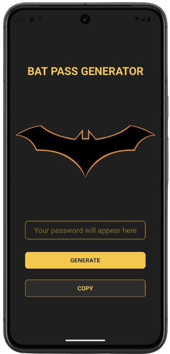
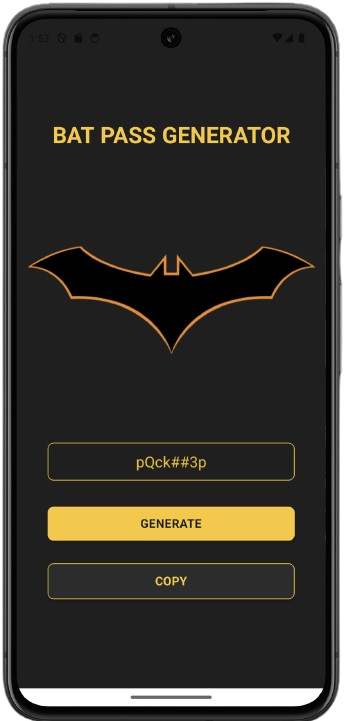

# 🦇 Bat Pass Generator

Um aplicativo mobile desenvolvido com **React Native + Expo** para gerar senhas seguras de forma rápida e simples.

---

## 📱 Preview

### 🔐 Gerador de senha

<p align="center">
  
</p>

### 📋 Resultado
<p align="center">
  
</p>

App minimalista com foco em:

* Geração de senhas aleatórias
* Interface limpa (dark mode)
* Copiar senha com um clique

---

## 🚀 Funcionalidades

* 🔐 Geração de senha aleatória
* 📋 Copiar senha para a área de transferência
* 🎨 Interface moderna (tema escuro + dourado)
* ⚡ Rápido e leve

---

## 🛠️ Tecnologias utilizadas

* React Native
* Expo
* TypeScript
* Expo Clipboard

---

## 📂 Estrutura do projeto

```
src/
├── components/
│   ├── BatButton/
│   ├── BatLogo/
│   └── BatTextInput/
├── screens/
│   └── Home/
├── services/
│   └── passwordService.ts
```

---

## ▶️ Como rodar o projeto

### 1. Clone o repositório

```bash
git clone https://github.com/DiegoMarayo/bat-pass-generator.git
cd bat-pass-generator
```

### 2. Instale as dependências

```bash
npm install
```

### 3. Inicie o projeto

```bash
npx expo start
```

### 4. Execute no dispositivo

* Pressione `a` → abrir no emulador Android
* Ou escaneie o QR Code com o app **Expo Go**

---

## 📦 Build (APK / AAB)

Para gerar build Android:

```bash
npx expo prebuild
npx expo run:android
```

Ou utilizando EAS (recomendado):

```bash
npx expo install expo-dev-client
npx expo prebuild
npx expo run:android
```

---

## 🎯 Objetivo do projeto

Este projeto foi desenvolvido com foco em aprendizado de **React Native**, abordando:

* Componentização
* Gerenciamento de estado (useState)
* Organização de código
* Criação de interfaces mobile

---

## 💡 Próximas melhorias

* [ ] Definir tamanho da senha
* [ ] Opções de caracteres (números, símbolos, etc.)
* [ ] Publicação na Play Store

---

## 📄 Licença

Este projeto está sob a licença MIT.

---

## 👨‍💻 Autor

Diego Marayo🚀
